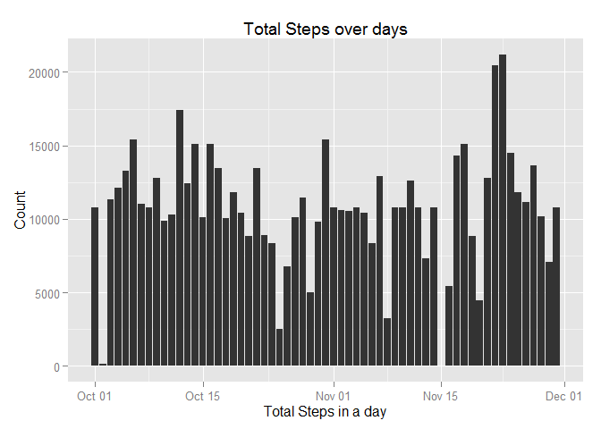
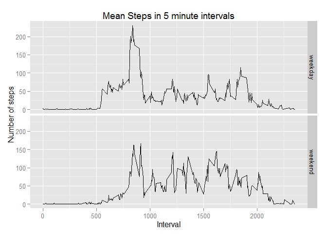

# Reproducible Research: Peer Assessment 1

## Loading and preprocessing the data

```r
## reading the csv file into R and changing the date format
activity <- read.csv("activity.csv")
activity$date <- as.Date(activity$date, "%Y-%m-%d")


## Viewing the data structure
head(activity)
```

```
##   steps       date interval
## 1    NA 2012-10-01        0
## 2    NA 2012-10-01        5
## 3    NA 2012-10-01       10
## 4    NA 2012-10-01       15
## 5    NA 2012-10-01       20
## 6    NA 2012-10-01       25
```


## What is mean total number of steps taken per day?

```r
## 1. Calculate the total number of steps per day
## aggregate to obtain the total steps per day
## ignoring missing values

dfActivity <- aggregate(x = list(totSteps = activity$steps), by = list(Date = activity$date), FUN = sum)

head(dfActivity, n = 20, na.rm = TRUE)
```

```
##          Date totSteps
## 1  2012-10-01       NA
## 2  2012-10-02      126
## 3  2012-10-03    11352
## 4  2012-10-04    12116
## 5  2012-10-05    13294
## 6  2012-10-06    15420
## 7  2012-10-07    11015
## 8  2012-10-08       NA
## 9  2012-10-09    12811
## 10 2012-10-10     9900
## 11 2012-10-11    10304
## 12 2012-10-12    17382
## 13 2012-10-13    12426
## 14 2012-10-14    15098
## 15 2012-10-15    10139
## 16 2012-10-16    15084
## 17 2012-10-17    13452
## 18 2012-10-18    10056
## 19 2012-10-19    11829
## 20 2012-10-20    10395
```

```r
## 2. Histogram of total number of steps taken each day
## plotting the count of steps

ggplot(dfActivity, aes(x = dfActivity$Date, y = dfActivity$totSteps))+
        geom_histogram(stat = "identity")+ labs(title = "Total Steps over days",
        x ="Total Steps in a day", y = "Count")
```

```
## Warning: Removed 8 rows containing missing values (position_stack).
```

 

```r
##3.  Mean and median of total number of steps taken per day
## mean and median of total steps per day
mean(dfActivity$totSteps, na.rm = TRUE)
```

```
## [1] 10766.19
```

```r
median(dfActivity$totSteps, na.rm = TRUE)
```

```
## [1] 10765
```


## What is the average daily activity pattern?

```r
## removing NA values and calculating average steps in an interval over days
dfMeanActivity <-  aggregate(x = list(meanSteps = activity$steps), by = list(interval = activity$interval), FUN = mean, na.rm = TRUE)

## 1. Make a time series plot of the 5 minute inteval and average number of steps taken 
## averaged across all days

ggplot(dfMeanActivity, aes(x=interval, y = meanSteps))+geom_line()+
        labs(title = "Mean Steps in 5 minute intervals", 
        x ="Time interval - 5 minute", y = "Mean steps")
```

 

```r
## 2. Which 5-minute interval, on average across all the days in the dataset,contains the maximum number of steps?

dfMeanActivity[dfMeanActivity$meanSteps == max(dfMeanActivity$meanSteps),]
```

```
##     interval meanSteps
## 104      835  206.1698
```


## Imputing missing values

```r
## Calculate and report the total number of missing values in the dataset

sum(is.na(activity$steps))
```

```
## [1] 2304
```

```r
##2. Device a strategy for filling in all missing values in the dataset. THe strategy does not need to be sophosticated. For example, you could use the mean/median for that day, or the mean for that 5-minute interval,etc.

##3. Create a new datset that is equal to the original dataset but the missing data filled in


## Filling in the missing data with mean of the interval and creating a new dataset


fillActivity <- activity

## Function to substitute NA values in the dataset with mean values
evalNAval <- function(index){
        temp <- activity[index,]
        return(dfMeanActivity$meanSteps[temp$interval == dfMeanActivity$interval])     
}

## row numbers corresponding to NA values

id <- which(is.na(activity$steps))

## replacing the NA values with the mean values

fillActivity$steps[is.na(activity$steps)] <- sapply(id, evalNAval)


dfActivityFill <- aggregate(x = list(totSteps = fillActivity$steps), by = list(Date = fillActivity$date), FUN = sum)

## new dataset with substitute values
head(fillActivity, n = 20)
```

```
##        steps       date interval
## 1  1.7169811 2012-10-01        0
## 2  0.3396226 2012-10-01        5
## 3  0.1320755 2012-10-01       10
## 4  0.1509434 2012-10-01       15
## 5  0.0754717 2012-10-01       20
## 6  2.0943396 2012-10-01       25
## 7  0.5283019 2012-10-01       30
## 8  0.8679245 2012-10-01       35
## 9  0.0000000 2012-10-01       40
## 10 1.4716981 2012-10-01       45
## 11 0.3018868 2012-10-01       50
## 12 0.1320755 2012-10-01       55
## 13 0.3207547 2012-10-01      100
## 14 0.6792453 2012-10-01      105
## 15 0.1509434 2012-10-01      110
## 16 0.3396226 2012-10-01      115
## 17 0.0000000 2012-10-01      120
## 18 1.1132075 2012-10-01      125
## 19 1.8301887 2012-10-01      130
## 20 0.1698113 2012-10-01      135
```

```r
## aggregate data set
head(dfActivityFill, n = 20)
```

```
##          Date totSteps
## 1  2012-10-01 10766.19
## 2  2012-10-02   126.00
## 3  2012-10-03 11352.00
## 4  2012-10-04 12116.00
## 5  2012-10-05 13294.00
## 6  2012-10-06 15420.00
## 7  2012-10-07 11015.00
## 8  2012-10-08 10766.19
## 9  2012-10-09 12811.00
## 10 2012-10-10  9900.00
## 11 2012-10-11 10304.00
## 12 2012-10-12 17382.00
## 13 2012-10-13 12426.00
## 14 2012-10-14 15098.00
## 15 2012-10-15 10139.00
## 16 2012-10-16 15084.00
## 17 2012-10-17 13452.00
## 18 2012-10-18 10056.00
## 19 2012-10-19 11829.00
## 20 2012-10-20 10395.00
```

```r
## 4. Make the histogram of total number of steps taken each day and Calculate and report mean and median total number of steps taken per day. Do these values differ from the estimates from the first part of the assignment? What is the impact of imputing missing data on the estimates of the total daily number of steps?

ggplot(dfActivityFill, aes(x = dfActivityFill$Date, y = dfActivityFill$totSteps))+
        geom_histogram(stat = "identity")+ labs(title = "Total Steps over days",
                                                x ="Total Steps in a day", y = "Count")
```

 

```r
## mean and median of new dataset
mean(dfActivityFill$totSteps)
```

```
## [1] 10766.19
```

```r
median(dfActivityFill$totSteps)
```

```
## [1] 10766.19
```

```r
## mean and median of old dataset
mean(dfActivity$totSteps, na.rm = TRUE)
```

```
## [1] 10766.19
```

```r
median(dfActivity$totSteps, na.rm = TRUE)
```

```
## [1] 10765
```

```r
## The mean and median values have not changed much with the mean value data insertion
```


## Are there differences in activity patterns between weekdays and weekends?

```r
## 1. Create a new factor variable in the dataset with two levels -- "weekday" and "weekend" indicating whether a given date is a weekday or weekend day.


evalDay <- function(dateVal){
        if (weekdays(dateVal) %in% c("Sunday","Saturday")) {
                return(0)
        } 
        return(1)
}

fillActivity$dayOfWeek <- sapply(fillActivity$date, evalDay)
fillActivity$dayOfWeek <- factor(fillActivity$dayOfWeek, levels = c(1,0), 
                                 labels = c("weekday", "weekend"))

head(fillActivity,n=20)
```

```
##        steps       date interval dayOfWeek
## 1  1.7169811 2012-10-01        0   weekday
## 2  0.3396226 2012-10-01        5   weekday
## 3  0.1320755 2012-10-01       10   weekday
## 4  0.1509434 2012-10-01       15   weekday
## 5  0.0754717 2012-10-01       20   weekday
## 6  2.0943396 2012-10-01       25   weekday
## 7  0.5283019 2012-10-01       30   weekday
## 8  0.8679245 2012-10-01       35   weekday
## 9  0.0000000 2012-10-01       40   weekday
## 10 1.4716981 2012-10-01       45   weekday
## 11 0.3018868 2012-10-01       50   weekday
## 12 0.1320755 2012-10-01       55   weekday
## 13 0.3207547 2012-10-01      100   weekday
## 14 0.6792453 2012-10-01      105   weekday
## 15 0.1509434 2012-10-01      110   weekday
## 16 0.3396226 2012-10-01      115   weekday
## 17 0.0000000 2012-10-01      120   weekday
## 18 1.1132075 2012-10-01      125   weekday
## 19 1.8301887 2012-10-01      130   weekday
## 20 0.1698113 2012-10-01      135   weekday
```

```r
## 2. Make a panel plot containing a time series plot (i.e. type = "l") of the 5-minute interval (x-axis) and the average number of steps taken, averaged across all weekday days or weekend days (y-axis).

dfWkActivity <- aggregate(list(meanSteps = fillActivity$steps), by =  list(interval = fillActivity$interval,dayOfWeek = fillActivity$dayOfWeek), FUN = mean)


ggplot(dfWkActivity, aes(x=interval, y = meanSteps, col = dayOfWeek))+geom_line()+
        labs(title = "Mean Steps in 5 minute intervals", 
             x ="Interval", y = "Number of steps")+
        facet_grid(dayOfWeek~.)
```

 


#### During weekdays there is increased activity around 8 to 10 interval, which subsides over the time till night. During weekends peak activity happens a little later than weekdays and is maintained around 50 steps till about 2000 at night. Night time steps are also shifted a little to the right compared to the weekdays.
