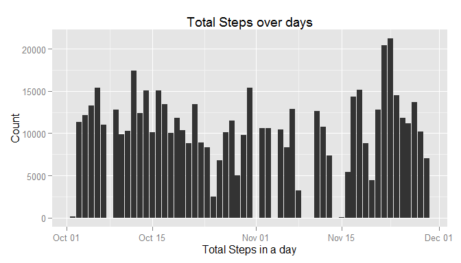
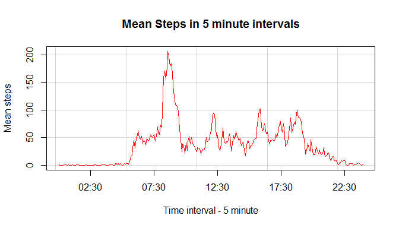
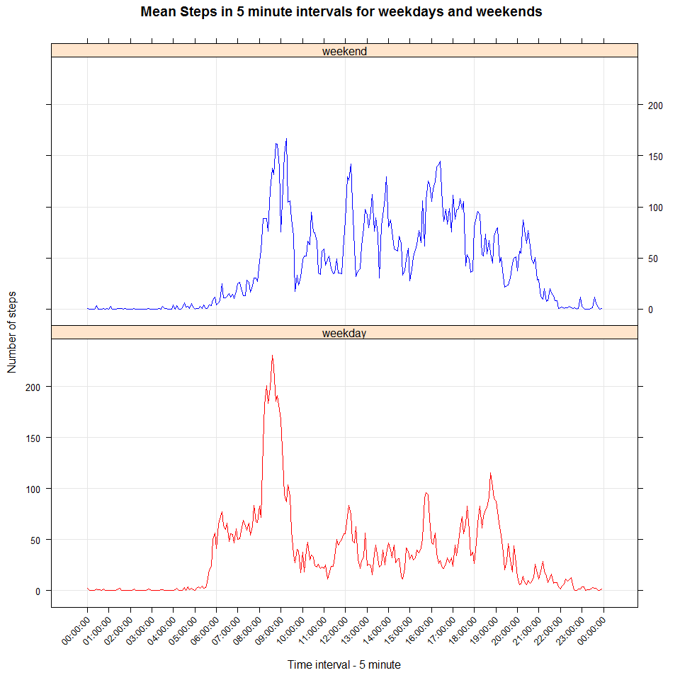

# Reproducible Research: Peer Assessment 1

The objective of this assignment is to create a R markdown document for the Peer Assessment 1 for the coursera course repdata-032: Reproducible Data Research. The excercise includes to test the understanding of the R markdown while doing a simple analytical problem.

It involves the usage of data from a personal activity monitoring device, with data collected ( number of steps taken in a five minute interval all day) every 5 minutes over a 2 month period(October to November, 2012) from an anonymous user.


### 1. Loading required library for data processing


```r
if (!("ggplot2") %in% installed.packages()) install.packages("ggplot2")
if (!("dplyr") %in% installed.packages()) install.packages("dplyr")
library(dplyr)
library(ggplot2)
if (!("activity.csv" %in% dir())) unzip("activity.zip")
```

### 2. Loading and preprocessing the data

Dataset is stored in "activity.csv" file and is read into dataset, and the format of the date column is changed. Summary of the data is provided.  

```r
## reading the csv file into R and changing the date format
activity <- read.csv("activity.csv")
activity$date <- as.Date(activity$date, "%Y-%m-%d")

## summary of the data
summary(activity)
```

```
##      steps             date               interval     
##  Min.   :  0.00   Min.   :2012-10-01   Min.   :   0.0  
##  1st Qu.:  0.00   1st Qu.:2012-10-16   1st Qu.: 588.8  
##  Median :  0.00   Median :2012-10-31   Median :1177.5  
##  Mean   : 37.38   Mean   :2012-10-31   Mean   :1177.5  
##  3rd Qu.: 12.00   3rd Qu.:2012-11-15   3rd Qu.:1766.2  
##  Max.   :806.00   Max.   :2012-11-30   Max.   :2355.0  
##  NA's   :2304
```

```r
## quick peak into values in columns
str(activity)
```

```
## 'data.frame':	17568 obs. of  3 variables:
##  $ steps   : int  NA NA NA NA NA NA NA NA NA NA ...
##  $ date    : Date, format: "2012-10-01" "2012-10-01" ...
##  $ interval: int  0 5 10 15 20 25 30 35 40 45 ...
```


The dataset has 17568 observations with three variables.  

##### Variables
- **steps**: Number of steps taking in a 5-minute interval (missing values are coded as NA)

- **date**: The date on which the measurement was taken in YYYY-MM-DD format

- **interval**: Identifier for the 5-minute interval in which measurement was taken


### 3. What is mean total number of steps taken per day?

Questions:  
1. Make a histogram of the total number of steps taken each day.  
2. Calculate and report the mean and median total number of steps taken per day

```r
## ignoring missing values as per the question states, (this will however be done by the histogram with NA equated to zero)

igActivity <- activity[complete.cases(activity),]

## column values with NA ignored
str(igActivity)
```

```
## 'data.frame':	15264 obs. of  3 variables:
##  $ steps   : int  0 0 0 0 0 0 0 0 0 0 ...
##  $ date    : Date, format: "2012-10-02" "2012-10-02" ...
##  $ interval: int  0 5 10 15 20 25 30 35 40 45 ...
```

```r
## aggregate to obtain the total steps per day
dfActivity <- aggregate(x = list(totSteps = igActivity$steps), by = list(Date = igActivity$date), FUN = sum)

## ummary of data
summary(dfActivity)
```

```
##       Date               totSteps    
##  Min.   :2012-10-02   Min.   :   41  
##  1st Qu.:2012-10-16   1st Qu.: 8841  
##  Median :2012-10-29   Median :10765  
##  Mean   :2012-10-30   Mean   :10766  
##  3rd Qu.:2012-11-16   3rd Qu.:13294  
##  Max.   :2012-11-29   Max.   :21194
```


```r
## plotting the count of steps

ggplot(dfActivity, aes(x = dfActivity$Date, y = dfActivity$totSteps))+
        geom_histogram(stat = "identity")+ labs(title = "Total Steps over days",
        x ="Total Steps in a day", y = "Count")
```




```r
## mean and median of total steps per day ignoring NA values
meanTotal <- prettyNum(mean(dfActivity$totSteps, na.rm = TRUE))
medianTotal <- prettyNum(median(dfActivity$totSteps, na.rm = TRUE))
```
Mean of the data is 10766.19   
Median of the data is 10765

### 4. What is the average daily activity pattern?

Questions:  
1. Make a time series plot (i.e. type = "l") of the 5-minute interval (x-axis) and the average number of steps taken, averaged across all days (y-axis)  
2. Which 5-minute interval, on average across all the days in the dataset, contains the maximum number of steps?  

```r
## removing NA values and calculating average steps in an interval over days
dfMeanActivity <-  aggregate(x = list(meanSteps = activity$steps), by = list(interval = activity$interval), FUN = mean, na.rm = TRUE)
```


```r
ggplot(dfMeanActivity, aes(x=interval, y = meanSteps))+geom_line()+
        labs(title = "Mean Steps in 5 minute intervals", 
        x ="Time interval - 5 minute", y = "Mean steps")
```




```r
## maximum activity is found and interval is noted
maxActivity <- dfMeanActivity[dfMeanActivity$meanSteps == max(dfMeanActivity$meanSteps),]
maxActivity
```

```
##     interval meanSteps
## 104      835  206.1698
```

Peak activity is around 835 interval in the morning corresponding to the maximum number of steps

### 5. Imputing missing values

Questions:  
1. Calculate and report the total number of missing values in the dataset (i.e. the total number of rows with NAs)  
2. Devise a strategy for filling in all of the missing values in the dataset. The strategy does not need to be sophisticated. For example, you could use the mean/median for that day, or the mean for that 5-minute interval, etc.
3. Create a new dataset that is equal to the original dataset but with the missing data filled in.
4. Make a histogram of the total number of steps taken each day and Calculate and report the mean and median total number of steps taken per day. Do these values differ from the estimates from the first part of the assignment? What is the impact of imputing missing data on the estimates of the total daily number of steps?


```r
## Calculating the total number of missing values in the dataset
missVal <- sum(!complete.cases(activity))
missVal
```

```
## [1] 2304
```

Total number of missing values is 2304


```r
## Filling in the missing data with mean of the interval,ie, if data is missing in interval "5", then 'mean for the interval "5" over days' is filled in that position and thereby, creating a new dataset

fillActivity <- activity

## Function to substitute NA values in the dataset with mean values
evalNAval <- function(index){
        temp <- activity[index,]
        return(dfMeanActivity$meanSteps[temp$interval == dfMeanActivity$interval])     
}

## row numbers corresponding to NA values to define which of the values to replace
id <- which(is.na(activity$steps))

## replacing the NA values with the mean values
fillActivity$steps[is.na(activity$steps)] <- sapply(id, evalNAval)

## sample of original dataset
str(activity)
```

```
## 'data.frame':	17568 obs. of  3 variables:
##  $ steps   : int  NA NA NA NA NA NA NA NA NA NA ...
##  $ date    : Date, format: "2012-10-01" "2012-10-01" ...
##  $ interval: int  0 5 10 15 20 25 30 35 40 45 ...
```

```r
## sample column values for substituted dataset
str(fillActivity)
```

```
## 'data.frame':	17568 obs. of  3 variables:
##  $ steps   : num  1.717 0.3396 0.1321 0.1509 0.0755 ...
##  $ date    : Date, format: "2012-10-01" "2012-10-01" ...
##  $ interval: int  0 5 10 15 20 25 30 35 40 45 ...
```

```r
## aggregate to obtain the total steps per day
dfActivityFill <- aggregate(x = list(totSteps = fillActivity$steps), by = list(Date = fillActivity$date), FUN = sum)

## summary of aggregated dataset
summary(dfActivityFill)
```

```
##       Date               totSteps    
##  Min.   :2012-10-01   Min.   :   41  
##  1st Qu.:2012-10-16   1st Qu.: 9819  
##  Median :2012-10-31   Median :10766  
##  Mean   :2012-10-31   Mean   :10766  
##  3rd Qu.:2012-11-15   3rd Qu.:12811  
##  Max.   :2012-11-30   Max.   :21194
```


```r
## Histogram of total number of steps taken each day and Calculate and report mean and median total number of steps taken per day. 

ggplot(dfActivityFill, aes(x = dfActivityFill$Date, y = dfActivityFill$totSteps))+
        geom_histogram(stat = "identity")+ labs(title = "Total Steps over days",
                                                x ="Total Steps in a day", y = "Count")
```


```r
## mean and median of new dataset
mean(dfActivityFill$totSteps)
```

```
## [1] 10766.19
```

```r
median(dfActivityFill$totSteps)
```

```
## [1] 10766.19
```

```r
## mean and median of old dataset
mean(dfActivity$totSteps, na.rm = TRUE)
```

```
## [1] 10766.19
```

```r
median(dfActivity$totSteps, na.rm = TRUE)
```

```
## [1] 10765
```
  
The mean and median values have not changed much with the mean value data insertion. The graph however shows data for October 1, which was removed earlier because of non availability, the total data is filled in, however does not alter the mean and median values much, which might be due to the fact that mean interval value was added.
  

### 6. Are there differences in activity patterns between weekdays and weekends?
  
Questions:  
1. Create a new factor variable in the dataset with two levels -- "weekday" and "weekend" indicating whether a given date is a weekday or weekend day.  
2. Make a panel plot containing a time series plot (i.e. type = "l") of the 5-minute interval (x-axis) and the average number of steps taken, averaged across all weekday days or weekend days (y-axis).  

```r
## Function to evaluate if a day is weekday or weekend
## Returns "1" for "weekday" and "0" for "weekend"
evalDay <- function(dateVal){
        if (weekdays(dateVal) %in% c("Sunday","Saturday")) {
                return(0)
        } 
        return(1)
}

## Creating new column day of week and evaluationg if "weekday" or "weekend"
fillActivity$dayOfWeek <- sapply(fillActivity$date, evalDay)

## Factor variable relabelled with appropriate easily understood names
## 1 --> weekday, 0 --> weekend
fillActivity$dayOfWeek <- factor(fillActivity$dayOfWeek, levels = c(1,0), 
                                 labels = c("weekday", "weekend"))

## Dataset column values
str(fillActivity)
```

```
## 'data.frame':	17568 obs. of  4 variables:
##  $ steps    : num  1.717 0.3396 0.1321 0.1509 0.0755 ...
##  $ date     : Date, format: "2012-10-01" "2012-10-01" ...
##  $ interval : int  0 5 10 15 20 25 30 35 40 45 ...
##  $ dayOfWeek: Factor w/ 2 levels "weekday","weekend": 1 1 1 1 1 1 1 1 1 1 ...
```

```r
## summary of fillActivity dataset
summary(fillActivity)
```

```
##      steps             date               interval        dayOfWeek    
##  Min.   :  0.00   Min.   :2012-10-01   Min.   :   0.0   weekday:12960  
##  1st Qu.:  0.00   1st Qu.:2012-10-16   1st Qu.: 588.8   weekend: 4608  
##  Median :  0.00   Median :2012-10-31   Median :1177.5                  
##  Mean   : 37.38   Mean   :2012-10-31   Mean   :1177.5                  
##  3rd Qu.: 27.00   3rd Qu.:2012-11-15   3rd Qu.:1766.2                  
##  Max.   :806.00   Max.   :2012-11-30   Max.   :2355.0
```


```r
## aggregate dataset with average steps in an interval during weekend and weekdays
dfWkActivity <- aggregate(list(meanSteps = fillActivity$steps), by =  list(interval = fillActivity$interval,dayOfWeek = fillActivity$dayOfWeek), FUN = mean)

## panel plot with a time series plot (i.e. type = "l") of the 5-minute interval (x-axis) and the average number of steps taken, averaged across all weekday days or weekend days (y-axis).
ggplot(dfWkActivity, aes(x=interval, y = meanSteps, col = dayOfWeek))+geom_line()+
        labs(title = "Mean Steps in 5 minute intervals", 
             x ="Interval", y = "Number of steps")+
        facet_grid(dayOfWeek~.)
```




During **weekdays** there is _**increased**_ activity around **8 to 10** interval(roughly), which subsides over the time till night. During weekends peak activity happens a little later than weekday. Night time steps are also shifted a little to the right compared to the weekdays.The peak activity during a weekday is 230 during the interval 835 and that of weekend is 167 during the interval 915 which is lesser than weekend. But the mean activity all through weekend is 42 is higher than the weekday mean 36, which implies a higher level of activity through out the day during weekend than that in weekday.

